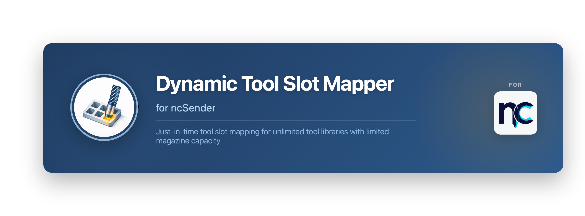

# Dynamic Tool Slot Mapper

**Version**: 1.0.0  
**Category**: Utility  
**Requirements**: ncSender 0.3.131+

A ncSender plugin that provides just-in-time tool slot mapping for unlimited tool libraries with limited magazine capacity. Perfect for machines with ATC (Automatic Tool Changer) where your tool library exceeds your physical magazine size.

---

## 🎯 Overview

This plugin addresses a common challenge in CNC machining: managing unlimited tool libraries with limited magazine capacity. When you load a G-code file with tool changes (e.g., `T84 M6`), this plugin dynamically maps tools to available slots just-in-time:

1. **Shows your ATC layout** visually with color-coded slot status
2. **Maps tool numbers** to your physical magazine slots dynamically
3. **Translates G-code** automatically (e.g., `T84 M6` → `T6 M6`)
4. **Handles conflicts** intelligently with smart slot swapping

## ✨ Key Features

### Visual Slot Management
- **Visual slot carousel**: See all ATC slots at a glance with color-coded status
  - 🟢 **Green**: Tool is in slot AND used in your G-code
  - ⚙️ **Grey**: Tool is in slot but NOT used in G-code
  - **Empty (—)**: No tool assigned to slot
- **Interactive mapping**: Click any tool to assign/reassign slots with dropdown selector
- **Smart swapping**: Automatically handles conflicts when slots are occupied
- **Unknown tool handling**: Map tools that aren't in your library (temporary, session-only)

### Automatic Translation
- **Automatic remapping**: `T84 M6` in G-code → `T6 M6` based on your slot assignments
- **Real-time updates**: Dialog refreshes instantly after slot changes
- **Magazine size detection**: Respects your ncSender ATC configuration
- **Preserves comments**: Original tool numbers preserved in comments for reference

### Status & Validation
- **Visual status**: 🟢 All ready / 🟡 Manual change needed / 🔴 Tools missing
- **Real-time validation**: See which tools need attention before proceeding

*G-code translation with visual slot carousel and interactive mapping*

---

## 🚀 Installation

1. **Download** the latest release: [`com.ncsender.dynamic-tool-slot-mapper-v1.0.0.zip`](https://github.com/cotepat/ncsender-plugin-dynamic-tool-slot-mapper/releases/latest)
2. In ncSender, go to **Settings → Plugins → Install Plugin**
3. Select the downloaded `.zip` file
4. Restart ncSender if prompted

---

## 📖 How to Use

### Loading G-Code

1. Load any G-code file with tool changes (e.g., `T## M6`)
2. **Visual slot carousel** shows your ATC layout:
   - Green = tool is in slot and used in G-code
   - Grey = tool is in slot but not used in G-code
   - Empty = no tool in slot
3. **Tool table** lists all tools with their current status
4. **Click any tool row** to open slot assignment dropdown
5. **Select target slot** - automatically handles swaps if slot is occupied
6. Click **Map Tools** to translate and proceed, or **Bypass Mapping** to skip

### Assigning Tool Slots

**To assign a tool to a slot:**
1. Click the tool's row in the table
2. Select target slot from dropdown
3. If slot is occupied, you'll see "Swap with #XX" - select it to swap
4. Dialog refreshes automatically to show new assignments

**Unknown Tools** (not in your library):
- Can be mapped to slots temporarily (for this G-code only)
- Session mappings don't persist after closing
- Shows with red "Unknown" status badge

**Smart Slot Swapping:**
- Automatically handles conflicts when two tools want the same slot
- 3-step swap process prevents conflicts
- Works for library tools, unknown tools, or combinations

---

## ⚙️ Settings

Access settings in **Settings → Plugins → Dynamic Tool Slot Mapper**:

- **Enable Automatic Tool Number <-> ATC Slot Mapping**: Toggles automatic G-code translation on/off
  - When enabled: Tool numbers are translated based on slot assignments
  - When disabled: Original tool numbers are passed through unchanged

---

## 🎨 Status Indicators

The plugin uses color-coded status indicators:

- **🟢 Ready**: Tool is mapped and in the tool library
- **🟡 Unmapped**: Tool needs slot assignment
- **🔴 Unknown**: Tool is not in your library (can be temporarily mapped)

---

## 🔧 Technical Details

### Tool Mapping Process
1. Parses all `M6`, `T##`, and `H##` commands in G-code
2. Loads tool library and current slot assignments from ncSender
3. Shows interactive dialog with visual slot carousel and tool table
4. User can reassign any tool to any slot (with automatic conflict resolution)
5. Translates all tool references when user clicks "Map Tools"
6. Preserves original tool IDs in comments for reference

### Slot Assignment
- **Library Tools**: Slot assignments persist in ncSender's tool library
- **Unknown Tools**: Temporary slot mappings (session-only, don't persist)
- **Smart Swapping**: 3-step swap process prevents slot conflicts

### Compatibility
- **ncSender**: 0.3.131+
- **G-code**: Standard tool change commands (M6, T##, H##)

---

## 🤝 Contributing

Contributions are welcome! Please see [CONTRIBUTING.md](CONTRIBUTING.md) for guidelines.

---

## 📄 License

This plugin is provided as-is for use with ncSender.

---

**Repository**: [github.com/cotepat/ncsender-plugin-dynamic-tool-slot-mapper](https://github.com/cotepat/ncsender-plugin-dynamic-tool-slot-mapper)
